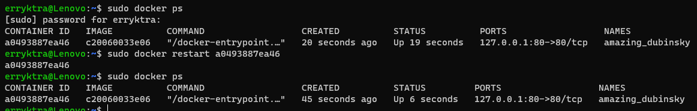
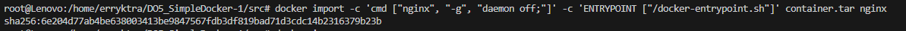

## Part 1. Готовый докер

* Взять официальный докер образ с **nginx** и выкачать его при помощи `docker pull`
    * Заранее нужно установить docker через `sudo snap install docker`
    * Затем через `sudo docker pull nginx` берём официальный докер образ
    * 
* Проверить наличие докер образа через `docker images`
    * Проверяем наличие образа через `sudo docker images`
    * 
* Запустить докер образ через `docker run -d [image_id|repository]`
    * Запуск докера через `sudo docker run -d c20060033e06`
    * 
* Проверить, что образ запустился через `docker ps`
    * Проверка, что образ запустился
    * 
* Посмотреть информацию о контейнере через `docker inspect [container_id|container_name]`
    * Просмотр информации (вставлена только часть вывода)
    * 
* По выводу команды определить и поместить в отчёт размер контейнера, список замапленных портов и ip контейнера (Сам вывод очень большой, поэтому оставлены только необходимые части)
    * размер контейнера
        * 186779301
        * 
    * список замапленных портов
        * 80/tcp
        * 
    * ip контейнера
        * 172.17.0.2
        * 
* Остановить докер образ через `docker stop [container_id|container_name]`
    * Останавливаем докер образ командой `sudo docker stop 1aa25f21a6bf`
    * 
* Проверить, что образ остановился через `docker ps`
    * Проверяем остановился ли образ
    * 
* Запустить докер с портами 80 и 443 в контейнере, замапленными на такие же порты на локальной машине, через команду *run*
    * Используем команду `sudo docker run -p 127.0.0.1:443:443 -p 127.0.0.1:80:80 -d c20060033e06`
    * 
* Проверить, что в браузере по адресу *localhost:80* доступна стартовая страница **nginx**
    * переходим по адресу
    * 
* Перезапустить докер контейнер через `docker restart [container_id|container_name]`
    * перезапустим контейнер командой `sudo docker restart a0493887ea46` (вторая команда на скрине)
    * 
* Проверить любым способом, что контейнер запустился
    * на скрине видно, что сначала в STATUS указано 19 секунд работы и CREATED равен 20 секундам. После перезапуска время создания всё также отсылает к 45 секундам назад, а время работы всего 6 секунд.
    * 

## Part 2. Операции с контейнером
* Прочитать конфигурационный файл *nginx.conf* внутри докер контейнера через команду *exec*
    * Используем команду `docker exec charming_clarke cat etc/nginx/nginx.conf`
    * 
* Создать на локальной машине файл *nginx.conf*
* Настроить в нем по пути */status* отдачу страницы статуса сервера **nginx**
    * см [файл nginx.conf](part_2/nginx.conf)
    * скрин файла
    * 
* Скопировать созданный файл *nginx.conf* внутрь докер образа через команду `docker cp`
    * Использована команда: `docker cp part_2/nginx.conf charming_clarke:etc/nginx/nginx.conf`
    * 
* Перезапустить **nginx** внутри докер образа через команду *exec*
    * `docker exec my_nginx nginx -s reload` 
    * 
* Проверить, что по адресу *localhost:80/status* отдается страничка со статусом сервера **nginx**
    * 
* Экспортировать контейнер в файл *container.tar* через команду *export*
    * Использована команда: `docker export my_nginx > container.tar`
    * 
* Остановить контейнер
    * используем `docker stop my_nginx`
    * 
*  Удалить образ через `docker rmi [image_id|repository]`, не удаляя перед этим контейнеры
    * используем `docker rmi -f c20060033e06` (-f = force)
    * 
* Удалить остановленный контейнер
    * используем `docker rm my_nginx`
    * 
* Импортировать контейнер обратно через команду *import*
    * используем `docker import -c 'cmd ["nginx", "-g", "daemon off;"]' -c 'ENTRYPOINT ["/docker-entrypoint.sh"]' container.tar nginx`
    * 
* Запустить импортированный контейнер
    * docker run -p 80:80 -p 443:80 -d --name imported a6bd71f48f68
    * 
* Проверить, что по адресу *localhost:80/status* отдается страничка со статусом сервера **nginx**
    * заходим по адресу *localhost:80/status*
    * 