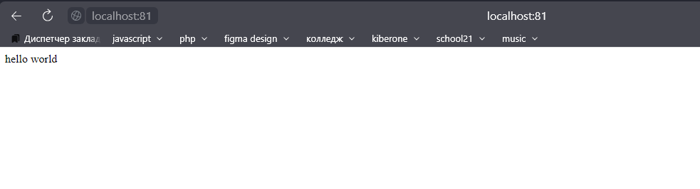

Эту часть задания я выполняла непосредственно на wsl, без докера
для запуска нужно установить libfcgi-dev nginx spawn-fcgi

``` bash
sudo apt-get install libfcgi-dev nginx spawn-fcgi 
```

1) копируем nginx.conf в /etc/nginx/ (заменив user на того под кем запускается)
    * `cp nginx.conf ~/../etc/nginx/nginx.conf`
2) перезапускаем `nginx -s reload`
3) компилируем server.c: `gcc server.c -lfcgi`
4) запускаем то что скомпилировали (например, ./a.out или ./server, если компилировали через -o seerver)
5) переходим по localhost:81
6) видим:
    