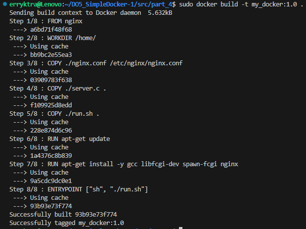
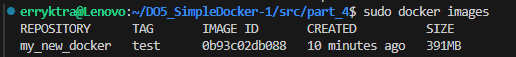
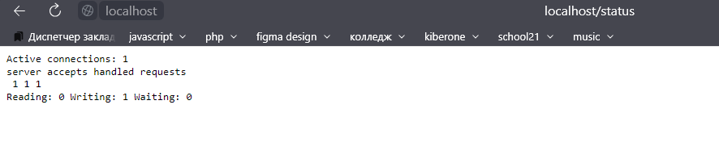

Собираем докер
``` bash
sudo docker build -t my_docker:1.0
# Можно задать любое имя и тег
```


Проверяем что собралось верно, прописав `sudo docker run -d -p 80:81 my_new_docker`



Проверяем localhost

