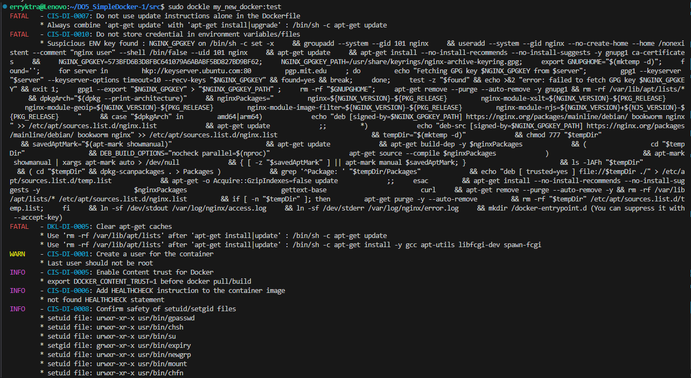
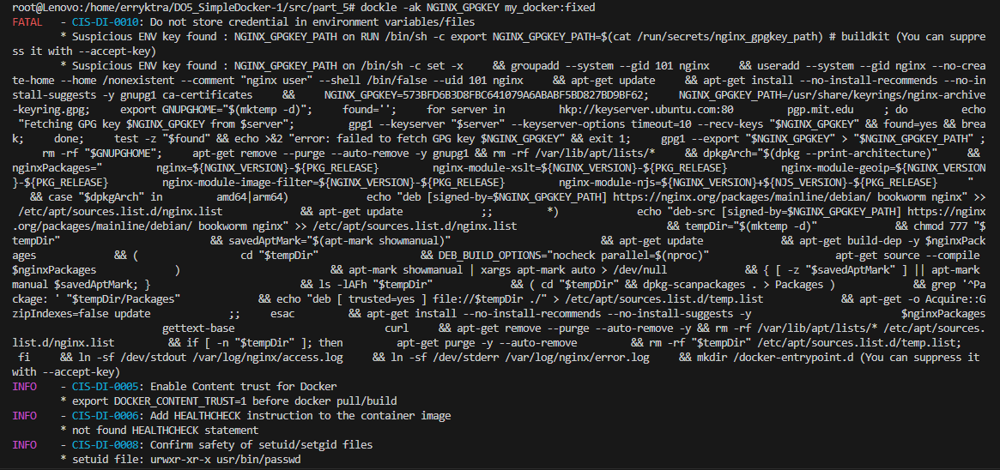

колчество ошибок до исправления:
`CIS-DI-0007`
`CIS-DI-0010`
`CIS-DI-0005`

колчество ошибок после исправления: `CIS-DI-0010`

*/данная ошибка связана с версией nginx и от неё фактически не избавиться, только замаскировать флагами/*
<!-- у меня почему-то не вышло замаксировать, ошибка появлялась независимо от их наличия -->