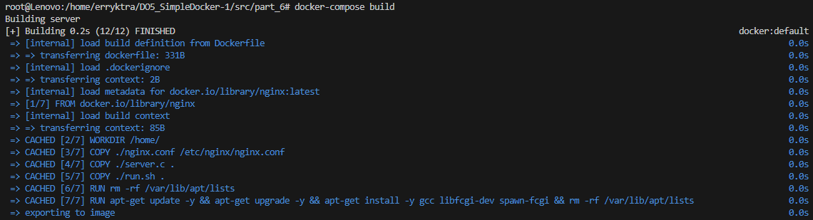
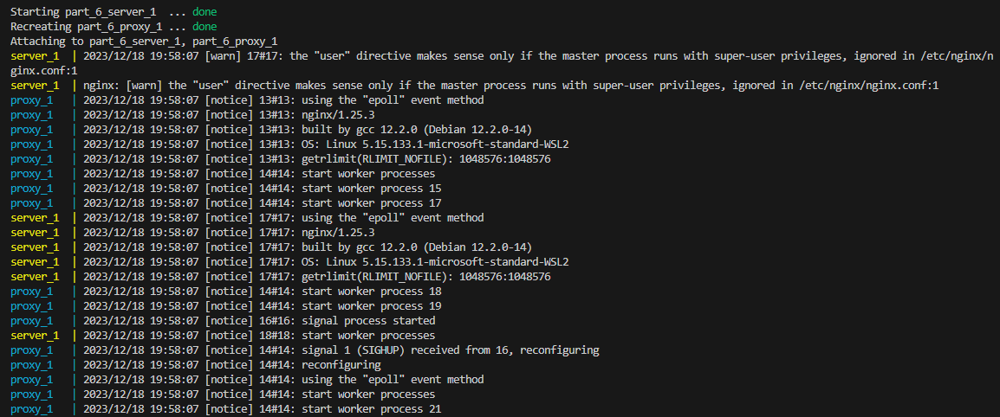
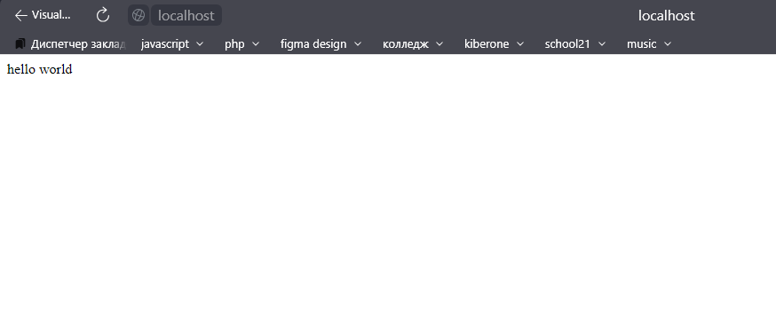
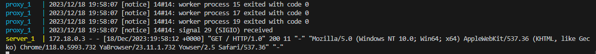

скачиваем docker-compose и buildx

запускаем docker-compose build

как закончит запускаем docker-compose up

(нет команды, так как были запущены через docker-compose build && docker-compose up)

переходим на localhost:80

видим GET-запрос в командной строке. это значит, что был переход на адрес localhost:80

